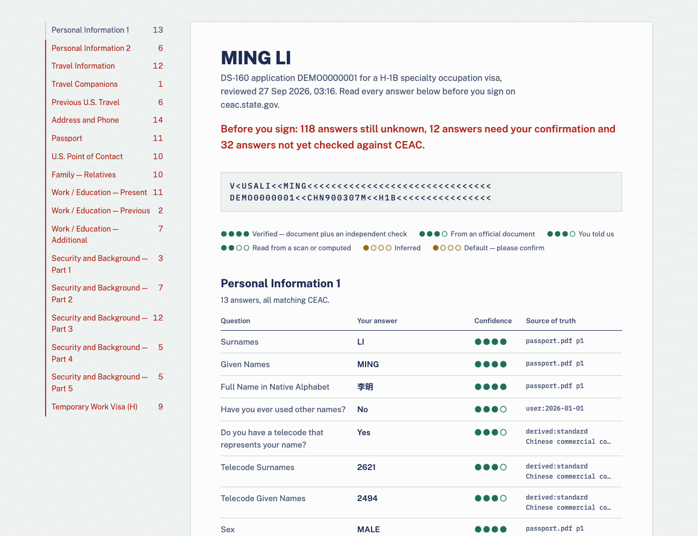

# DS-160 Form AutoFiller

**English** · [简体中文](README.zh-CN.md)

Fill the US visa application (DS-160) from your own documents, with an AI agent in your real browser, and
prove every answer before you sign.

Each answer carries where it came from and how sure we are. After every page, the tool reads back what the
State Department's site actually saved and reconciles it against your file. At the end you get a printable
review with every answer, its confidence and its source.



## Why

The DS-160 is ~300 fields spread across 18 sections. It has a 20-minute idle timeout and no autosave. It
punishes small inconsistencies, such as a date that disagrees with your I-94 or an address that differs from
your I-765. Autofill scripts save typing but not trust. This project keeps an evidence trail:

- **Your documents are the source of truth.** Passports, visas, I-20s, I-94 history, EADs, W-2s and offer
  letters are ingested read-only, hashed, and digested into text.
- **Every fact is sourced.** `{value, confidence, source}` — e.g. `raw/I-94/Travel_History.pdf#p1`, or
  `user:2026-09-27` when you said it.
- **Nothing is guessed silently.** Unknowns become a short questionnaire; defaults are marked `assumed`
  until you confirm them.
- **The live form is verified.** Every section is snapshotted from CEAC and reconciled field by field.
- **You stay in control.** The agent never solves captchas and never signs or submits.

## Pipeline

```
documents ──ingest──▶ raw/ + sha256 manifest ──digest──▶ text ──agent──▶ facts (value · confidence · source)
                                                                              │ validate: checksums, MRZ, cross-field
form spec (CEAC element ids) ─────────────────────────────────────────▶ sheet: expected value per field
                                                                              │ agent fills CEAC in Chrome
live page snapshots ──────────────────────────────────────────────────▶ recon: match / differ / unknown
                                                                              ▼
                                  OVERVIEW.md · QUESTIONNAIRE.md · review.html · review.pdf
```

One command runs it end to end:

```console
$ ds160 run AA00XXXXXX
 ✓ raw integrity      126 documents, sha256 intact
 ✓ digest             up to date
 ✓ validate profile   0 errors, 0 facts to confirm
 ✓ build sheet        288 fields, 0 unknown, 0 invalid
 ✓ recon vs CEAC      288 match, 0 differ, 0 unchecked, 0 open questions
 ✓ review document    review.html + review.pdf
```

## Quick start

Requirements: Python ≥ 3.11 and [uv](https://docs.astral.sh/uv/). Filling the live form needs
[Claude Code](https://claude.com/claude-code) with Claude in Chrome. The PDF export needs Chrome or Chromium.

```bash
git clone https://github.com/ChiChasesCheese/DS160-Form-AutoFiller && cd DS160-Form-AutoFiller
uv sync --all-extras
make demo            # the whole pipeline on a fictional applicant (examples/)
```

Or install the CLI only: `pipx install "ds160-autofiller[photo] @ git+https://github.com/ChiChasesCheese/DS160-Form-AutoFiller"`.

### With your own documents

```bash
ds160 ingest ~/Documents/immigration            # → raw/ (gitignored, never modified)
ds160 digest                                    # → data/digest/; INDEX.tsv flags scans that need eyes
# ask Claude Code: "follow skills/immigration-intake and build my profile"
ds160 validate                                  # 0 errors required
mkdir -p data/applications/AA00XXXXXX
cp examples/data/applications/DEMO0000001/application.yaml data/applications/AA00XXXXXX/
# ask Claude Code: "follow skills/ds160-autofill and fill AA00XXXXXX"
ds160 run AA00XXXXXX                             # recon + printable review
```

When the agent hits something it cannot know (your parents' dates of birth, for example), it writes
`QUESTIONNAIRE.md`. Answer in chat or drop a document into `raw/inbox/`. It persists the answer with its
source and carries on.

## Commands

| Command | What it does |
|---|---|
| `ds160 ingest SRC…` | Copy documents into `raw/` with a sha256 manifest. It is idempotent and never overwrites. |
| `ds160 verify-raw` | Fail if any file in `raw/` changed or disappeared. |
| `ds160 digest [--ocr]` | Extract text per page (PDF, DOCX; images via tesseract) into `data/digest/`. |
| `ds160 validate [--all]` | Run the profile checks: PRC ID checksum, passport MRZ check digits, ID-embedded birth date and sex, date order, telecode count, source grammar. |
| `ds160 sheet APP` | Build the expected CEAC value for every element, with the validator verdict. |
| `ds160 recon APP` | Compare the sheet with the live snapshots and write `OVERVIEW.md` and `QUESTIONNAIRE.md`. |
| `ds160 answer PATH VALUE` | Persist your answer with source and confidence (answers overlay). |
| `ds160 review APP [--mask]` | Write `review.html` and `review.pdf`. `--mask` hides SSN and national ID. |
| `ds160 photo IMG --hair Y --eyes Y --chin Y` | Crop and encode a compliant photo: square, 600–1200 px, ≤ 240 kB, head 50–69%, eyes 56–69% from the bottom. HEIC is supported. |
| `ds160 run APP` | Run everything above in order, with a pass/warn/fail per stage. |

`backhome` is an alias of `ds160`.

## Confidence levels

| Level | Meaning |
|---|---|
| `verified` | Official document **and** an independent confirmation (second document, checksum/MRZ, CEAC echo) |
| `high` | Text-extracted from an official document |
| `medium` | Visual/OCR read, or computed from documents |
| `user` | You said so; no document |
| `low` | Inference from indirect evidence |
| `assumed` | A default with no evidence. It must be confirmed before you sign. |

Source references: `raw/<path>#p<page>` · `user:YYYY-MM-DD` · `ceac:<page>` · `derived:<how>`.
`null` means unknown (ask); `__NA__` means does not apply.

## Using the agent skills

The browser work is done by Claude Code following two skills in this repo. Link them into your skills folder:

```bash
ln -s "$PWD/skills/immigration-intake" ~/.claude/skills/
ln -s "$PWD/skills/ds160-autofill"     ~/.claude/skills/
```

`skills/ds160-autofill/SKILL.md` also documents the CEAC quirks this project learned the hard way:
- Save/Next need a real click.
- Some dropdowns only reveal their fields after Save.
- "Do not know" boxes must be clicked, not set.
- Date formats differ per page.

## Project layout

```
src/backhome/          model (facts), validators, docs (ingest/digest), forms (sheet/recon/questionnaire),
                       review (HTML/PDF), photo, pipeline, cli
src/backhome/forms/ds160/spec.yaml   every CEAC element id across all 18 sections, captured live
src/backhome/ceac/     snapshot.js, nav.js — run inside the CEAC page
skills/                Claude Code skills (intake, autofill)
examples/data/         a fictional applicant used by tests, CI and the demo
raw/  data/            YOUR documents and facts — gitignored, never leave your machine
```

## Privacy and safety

- `raw/` and `data/` are gitignored. CI fails if either is ever tracked.
- Everything runs locally. The only network traffic is your own browser talking to ceac.state.gov.
- The agent does not solve captchas, sign, or submit. Retrieving the application, uploading the photo on
  identix.state.gov (with your permission), Review and Sign are yours.
- See [SECURITY.md](SECURITY.md).

## Disclaimer

This is not legal advice and is not affiliated with the U.S. Department of State. You are responsible for the
truthfulness of your application. Review every answer in the generated review before you sign.

## Contributing

Issues and PRs are welcome, especially new form specs (DS-260, I-765, …) and CEAC changes. See
[CONTRIBUTING.md](CONTRIBUTING.md). License: [MIT](LICENSE).
